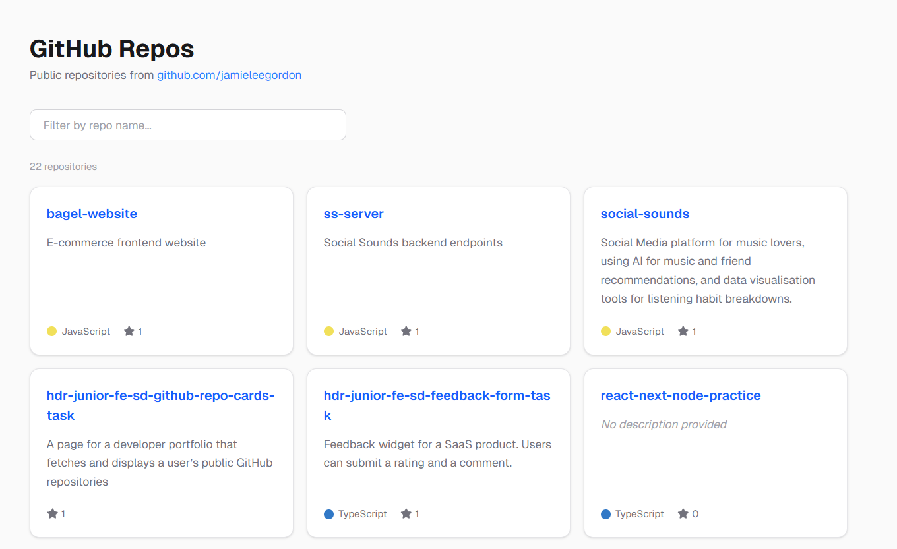

# GitHub Repo Cards

A Next.js app that fetches public GitHub repositories and displays them as searchable cards. Built with the App Router using Server Components for data fetching and a Client Component for real-time search filtering.

## What parts I used AI for note

I used AI for majority of the CSS, as this was the most time-efficient way of developing the styling, and it did a really good job of it. I also used AI for the main part of the searching feature, as I was running into a few bugs with repo cards not loading, and the AI did a good job of fixing it. The AI initially implemented data fetching using the useEffect hook, which retrieves data on the client after the page has rendered. In a Next.js App Router application, a better approach is to use a Server Component to fetch data during server-side rendering. This allows the data to be included in the initial HTML response, reducing client-side JavaScript execution and improving SEO and performance.

## Preview



## Features

- Displays repo name, description, primary language, and star count
- Real-time search filtering by repo name (no page reload)
- Skeleton loading state and error boundary with retry

## Getting Started

**Install dependencies**

```bash
npm install
```

**Run the development server**

```bash
npm run dev
```

Open [http://localhost:3000](http://localhost:3000) in your browser.

**Build for production**

```bash
npm run build
npm run start
```

## Tech

- [Next.js 16](https://nextjs.org) — App Router, Server Components
- [Tailwind CSS](https://tailwindcss.com) — styling
- [GitHub REST API](https://docs.github.com/en/rest) — repo data
